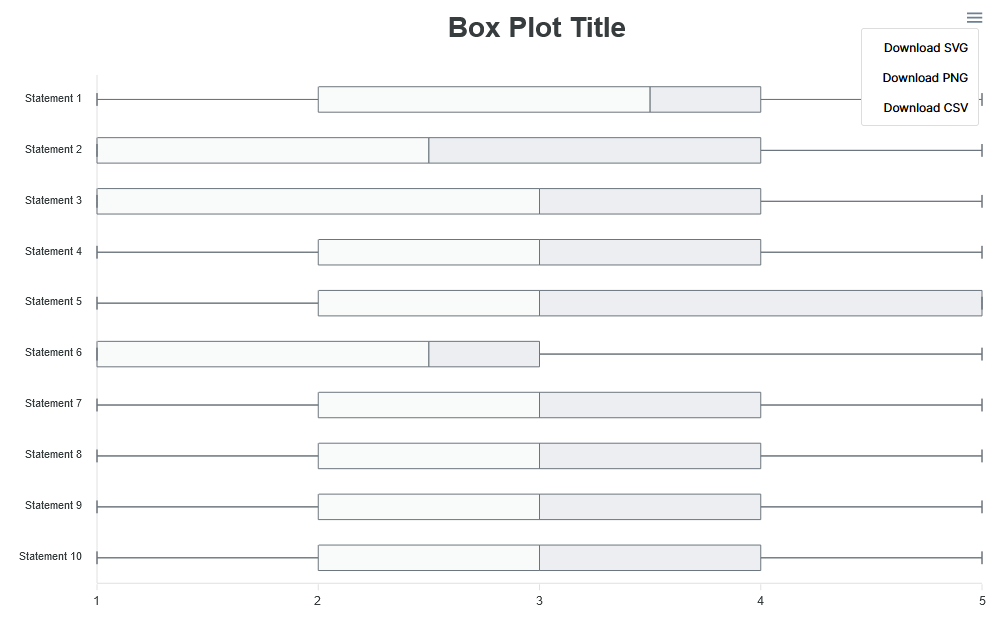
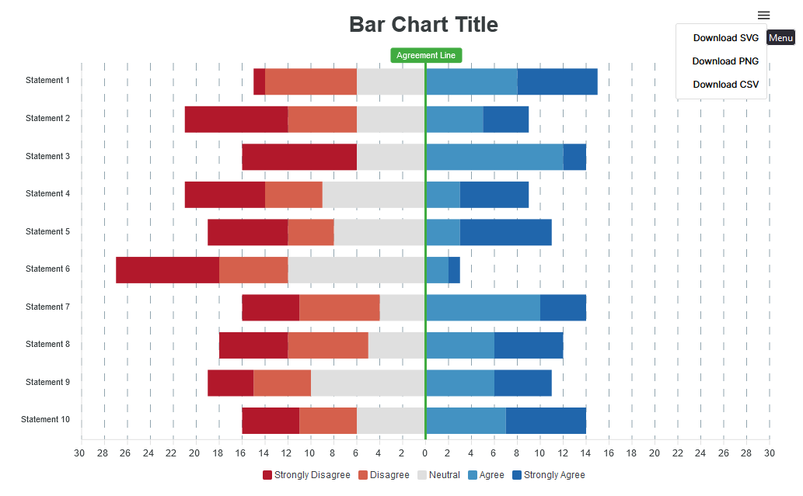

# Likert Charts
This repo demonstrates how to use [apexcharts](https://apexcharts.com/) to visualise likert data using box plots and stacked bar charts.

This branch is setup to handle 7-point likert scales. Checkout the [`main`](https://github.com/robdongas/likert-charts/tree/main) branch if you want a 5-point likert scale.


It is intended to be used by researchers who have some familiarity with Javascript (including React and the Apexcharts library). It is set up somewhat flexibly to allow different questionnaires.

The project is using [Vite](https://vitejs.dev/) for the dev server and build pipeline.

## Installation

Clone the project

```bash
  git clone https://github.com/robdongas/likert-charts
```

Go to the project directory

```bash
  cd likert-charts
```

Install dependencies

```bash
  npm install
```

Start the dev server

```bash
  npm run dev
```

## Data Setup
The files for your data are inside the `src/data` directory.

### Statements
The `responses.js` file should export an array containing all of the statements from your likert questionnaire.

```js
export const statements = [
  "Lorem ipsum dolor sit amet, consectetur adipiscing elit.",
  "Sed maximus lectus ut metus blandit egestas.",
  "Vestibulum vitae dolor nec diam ornare scelerisque non et lorem.",
  ...
]
```

### Responses

The `responses.js` file should export a JSON array, in which each item is a participant response.

```js
export const responses = [
  {
    id: 1,
    ratings: {
      s01: 1,
      s02: 2,
      s03: 1,
      ...
    },
  },
  ...
]
```

This can have up to 99 rating items, which should be labeled with leading zeros, e.g. `s01`. The value of these items should be the relevant participant's likert data from the questionnaire, as a number. 

## Chart Setup
The charts can be setup in the `src/App.jsx` file. Each chart is a React component, so that it would be possible to have multiple instances of the same chart on a page, with different data sources or statement ranges. This could be useful if you want to separately visualise different groups/conditions in your experiment or different subscales in your questionnaire.

### Box Plot
Instatiate the box plot with the following component:

```js
import LikertBoxPlot from "./components/LikertBoxPlot";
import { responses } from "./data/responses";

<LikertBoxPlot responses={responses} minStatement={1} maxStatement={10} title={"Box Plot Title"} />
```

|Argument| Description|
|---|---|
|responses| Should point to the imported response data.
|minStatement| The first statement in the range|
|maxStatement| The last statement in the range|
|title| The title of the chart (passed to apexcharts so it can be included in the exported png or svg image)

This results in the following chart which can be downloaded from the toolbar in the top right corner.


### Bar Chart
Instatiate the bar chart with the following component:

```js
import LikertBarChart from "./components/LikertBarChart";
import { responses } from "./data/responses";

<LikertBarChart responses={responses} minStatement={1} maxStatement={10} title={"Bar Chart Title"} />
```

|Argument| Description|
|---|---|
|responses| Should point to the imported response data.
|minStatement| The first statement in the range|
|maxStatement| The last statement in the range|
|title| The title of the chart (passed to apexcharts so it can be included in the exported png or svg image)

This results in the following chart which can be downloaded from the toolbar in the top right corner.



## References
https://stephanieevergreen.com/diverging-stacked-bars/
https://medium.com/analytics-vidhya/incremental-improvements-04-likert-scale-717e9c871361
https://www.perceptualedge.com/blog/?p=2239
https://blog.datawrapper.de/divergingbars/
https://towardsdatascience.com/diverging-bars-why-how-3e3ecc066dce

https://www.researchgate.net/publication/289590282_Design_of_Diverging_Stacked_Bar_Charts_for_Likert_Scales_and_Other_Applications
https://jtr13.github.io/cc19/chart-stacked-bar-chart-for-likert-data.html
https://peltiertech.com/diverging-stacked-bar-charts/


